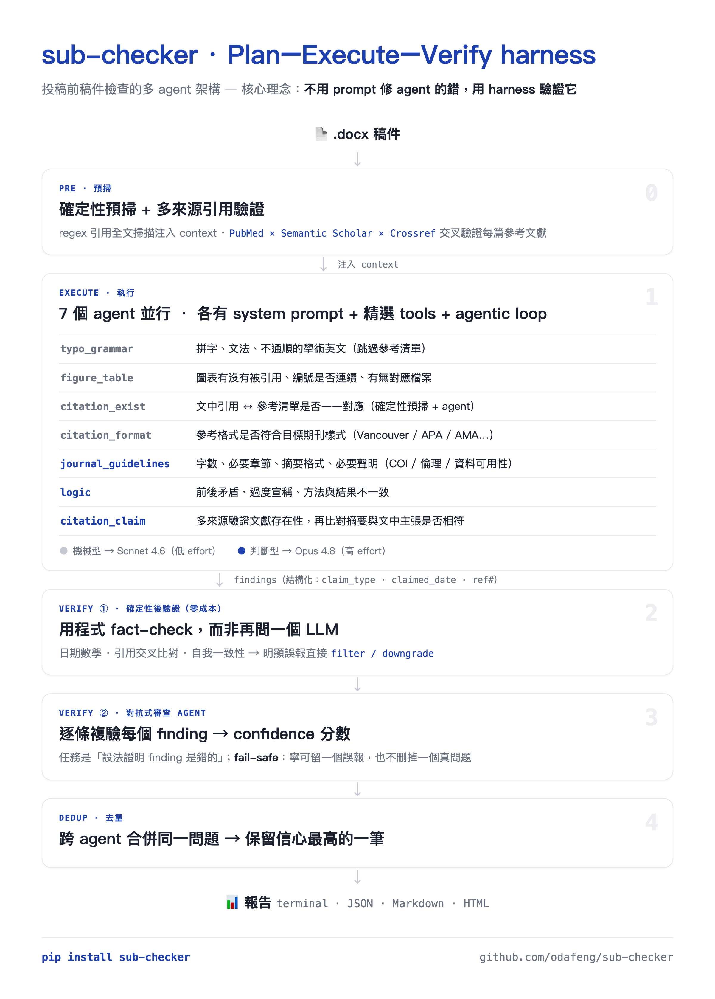
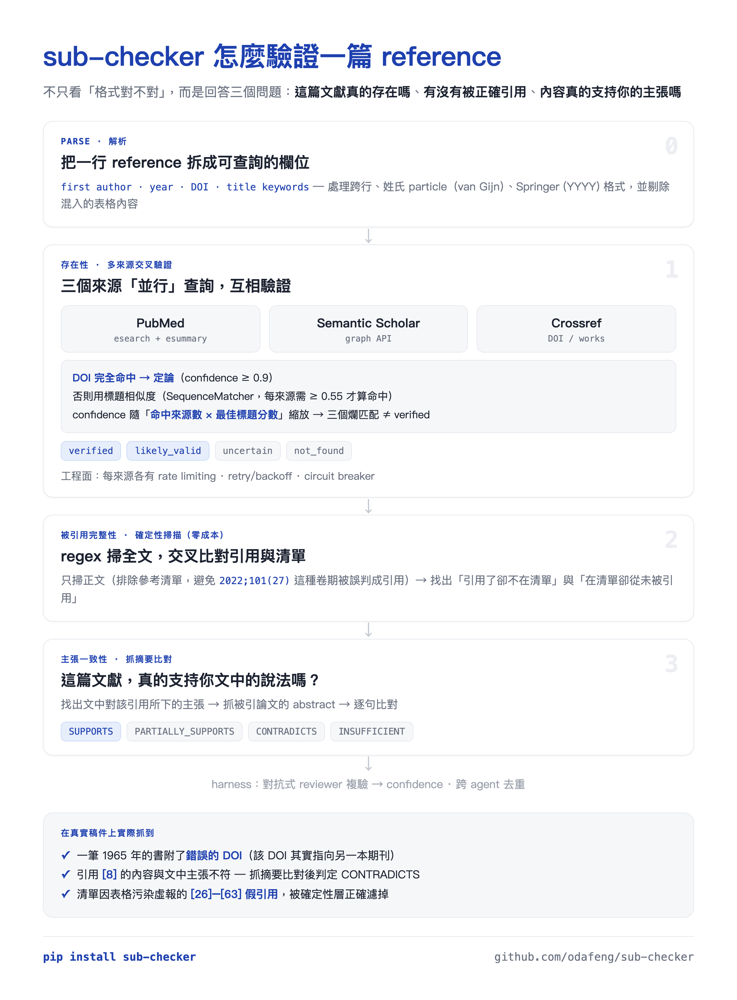

# sub-checker

[](https://pypi.org/project/sub-checker/)
[](https://pypi.org/project/sub-checker/)
[](https://github.com/odafeng/sub-checker/actions/workflows/ci.yml)
[](https://github.com/odafeng/sub-checker/blob/main/LICENSE)

[English](README.md) | 繁體中文

由 Claude agents 驅動的投稿前文稿檢查器，採用 Plan-Execute-Verify harness 架構。每項檢查由專門的 AI agent 執行，再經 deterministic 驗證和 reviewer agent 過濾 false positives。

## 檢查項目

| Agent | 功能 |
|-------|------|
| **typo_grammar** | 拼字、文法、不通順的語句（跳過參考文獻列表） |
| **figure_table** | 圖表引用是否存在、編號是否連續、檔案是否存在 |
| **citation_exist** | 文中引用與參考文獻列表是否一一對應（deterministic pre-scan + agent） |
| **citation_format** | 參考文獻列表是否符合目標期刊的引用格式（APA、Vancouver、AMA 等） |
| **journal_guidelines** | 字數、必要章節、摘要格式、必要聲明（COI、倫理、資料可用性） |
| **logic** | 矛盾、缺乏支持的主張、方法與結果不一致 |
| **citation_claim** | 三源驗證（PubMed + Semantic Scholar + Crossref），再比對引用論文摘要與文中主張 |

## Demo

🎥 **[看 60 秒 demo](docs/media/demo.mp4)** &nbsp;·&nbsp; [直式手機版](docs/media/demo-vertical.mp4)

### 整體架構



### 怎麼驗證一篇 reference



## 安裝

```bash
pip install sub-checker
```

## 設定

需要 Anthropic API key：

```bash
export ANTHROPIC_API_KEY=sk-ant-...
```

或在工作目錄建立 `.env` 檔案：

```
ANTHROPIC_API_KEY=sk-ant-...
```

## 使用方式

### CLI

```bash
# 完整檢查，指定目標期刊
sub-check paper.docx -j "The Lancet"

# 繁體中文報告
sub-check paper.docx -j "Nature Medicine" --lang zh-TW

# 只跑特定 checker（省錢省時間）
sub-check paper.docx --only figure,citation

# 跳過高成本 checker
sub-check paper.docx --skip claim,logic

# 輸出 HTML 報告（含 COT viewer + confidence scores）
sub-check paper.docx -o html --output-file report.html

# 輸出 JSON（供程式使用）
sub-check paper.docx -o json --output-file report.json

# Dry run（只 parse，不跑 agents）
sub-check paper.docx --dry-run
```

### Web GUI

GUI 需要原始 repo（React 前端**不會**隨 PyPI 套件發佈），外加 optional 的 web 後端相依套件：

```bash
git clone https://github.com/odafeng/sub-checker.git
cd sub-checker
pip install -e ".[web]"          # 後端：FastAPI + uvicorn

# 啟動後端
uvicorn sub_checker.api:app --reload

# 啟動前端（另開 terminal）
cd frontend && npm install && npm run dev
```

開啟 `http://localhost:5173` — 上傳 `.docx`、選期刊、跑檢查、看報告（含 confidence badges 和 false positive 過濾）。

### CLI 選項

```
sub-check [OPTIONS] MANUSCRIPT_PATH

引數：
  MANUSCRIPT_PATH    .docx 檔案路徑或包含 .docx 的目錄（加 --init 時可省略）

選項：
  -j, --journal      目標期刊名稱（如 "The Lancet"）
  -c, --config       設定檔路徑（預設：若存在則用 ./.sub-checker.yaml）
  -o, --output       terminal | json | markdown | html（預設：terminal）
  --output-file      將報告寫入檔案
  --lang             報告語言：en（預設）或 zh-TW
  --only             逗號分隔：typo,logic,figure,citation,format,guidelines,claim
  --skip             逗號分隔要跳過的 checker
  -v, --verbose      即時顯示 agent tool calls
  --dry-run          只做 .docx 解析，不跑 agents
  --init             產生預設 .sub-checker.yaml
```

## Pipeline（Plan-Execute-Verify）

```
Checkers   │  7 個 agents 並行執行（全域並發上限，預設一次 3 個）
Validate   │  Deterministic 後驗證（日期數學、引用交叉比對）
Review     │  Reviewer agent 為每個留下的 finding 評分 → confidence
Dedup      │  多個 checker 報告的同一問題，合併為信心最高的那筆
```

- **執行前**：deterministic 引用預掃 + 三源參考文獻驗證
- **執行後**：false positives 被過濾，留下的 findings 標註 confidence score（0-100%），跨 checker 重複項合併
- 詳見 [harness-architecture.md](docs/harness-architecture.md)

## HTML 報告功能

- 深色主題報告，帶嚴重程度標籤
- **Confidence scores** — 每個 finding 顯示 reviewer 給的可信度（%）
- **False positive 過濾** — deterministic + reviewer agent 移除錯誤的 findings
- **Chain of Thought viewer** — 展開後可看每個 API call、tool use、推理步驟
- **Model 顯示** — 報告標明使用哪個 Claude 模型
- 多語系支援（English / 繁體中文）

## 費用估算

預設情況下，判斷型 checker（logic、citation_claim、journal_guidelines）與 reviewer 使用
**Claude Opus 4.8**，機械型 checker（typo、figure、citation_exist、citation_format）則使用較便宜的
**Claude Sonnet 4.6**；並針對每個 checker 調校 `effort` 以壓低 token 用量。以一篇真實的
約 5,000 字、25 篇參考文獻的文稿實測：

| 範圍 | Agents | 時間 | 費用 |
|------|--------|------|------|
| 快速檢查 | `--only figure,citation` | ~3 min | ~$1 |
| 標準檢查 | `--skip claim` | ~6 min | ~$2–3 |
| 完整檢查 | 全部 7 agents + harness | ~10–12 min | ~$3–5 |

費用隨文稿長度與參考文獻數量增加（citation_claim 會對每篇參考文獻查 PubMed/Semantic
Scholar/Crossref）。可在 `.sub-checker.yaml` 覆寫任一模型（如全部設為 `claude-sonnet-4-6` 以降低費用）。

## 日誌

所有日誌存放在 `~/.sub-checker/`：

- `logs/sub-checker.log` — 應用日誌（自動輪替，10MB x 5）
- `logs/sub-checker.error.log` — 僅錯誤
- `cot/` — agent chain-of-thought JSON 日誌（每個 tool call、每個 response）

在 `.sub-checker.yaml` 設定 `cot_dir: "disabled"` 可關閉 COT 檔案日誌（HTML 報告中仍可看到）。

## 架構

- **Plan-Execute-Verify harness**：並行 checkers → deterministic 驗證 → reviewer → 去重（[ADR-0010](docs/adr/0010-plan-execute-verify-harness.md)）
- 7 個 agents + reviewer agent，各有 system prompt + 策劃的 tools + agentic loop（[ADR-0002](docs/adr/0002-agent-per-checker-architecture.md)）
- Parser 提供原始資料；agents 自行判斷文件結構（[ADR-0009](docs/adr/0009-agent-over-deterministic-parsing.md)）
- 三源引用驗證：PubMed + Semantic Scholar + Crossref（[ADR-0005](docs/adr/0005-semantic-scholar-fallback.md)）
- FastAPI + React + TypeScript GUI（[ADR-0006](docs/adr/0006-fastapi-react-gui.md)）
- [效能比較](docs/benchmark-comparison.md) | [Harness 架構](docs/harness-architecture.md)

## 授權

MIT
